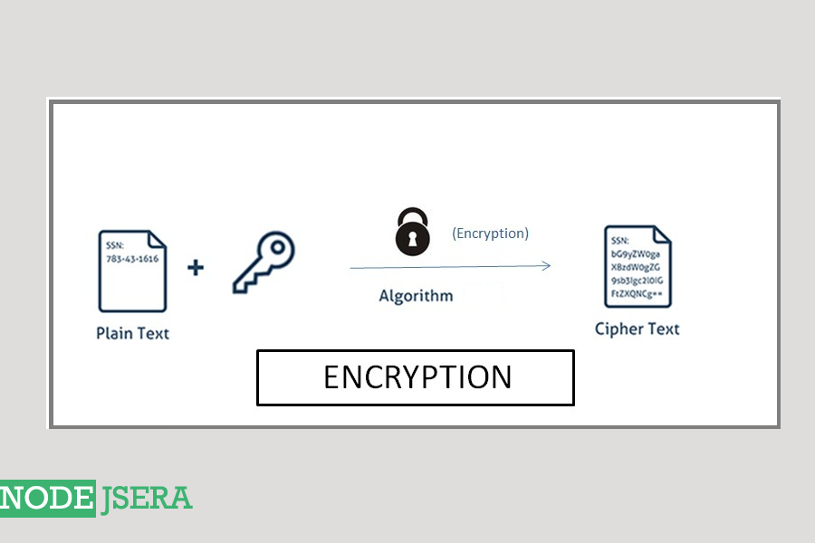
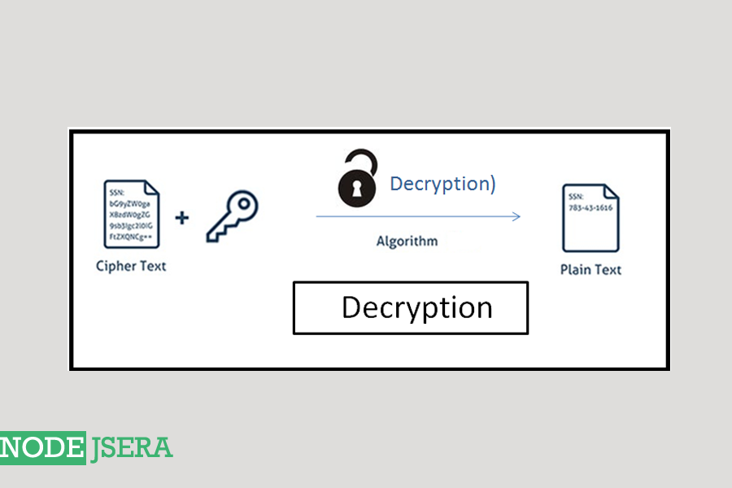

# Encryption

# Decryption

Types of Encryption
There are 2 ways to encrypt and decrypt the content which are explained in detail below :

Symmetric or private key encryption :
In symmetric , same key is used to perform encryption and decryption. It is fast as compared to asymmetric.

Asymmetric or public key encryption:
In asymmetric , we use a pair of keys to perform encryption and decryption. In simple words, key which is used to encrypt is different from the key which is used to decrypt. The key pair can be generated using openSSL or any other key pair generator. The key pair consist of a public key and a private key. Public key is known to all however the private key is only known to the person whom it belongs.For the problems Asymmetric encryption solves consider the following scenarios: