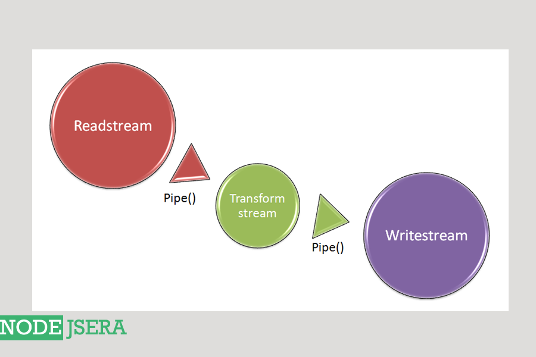
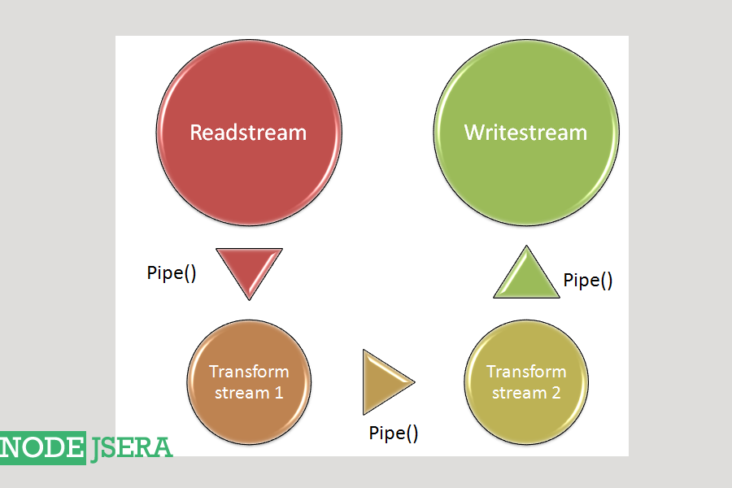

Streams
Streams are used to handle streaming data in node.js
Streams can be readable, writable or both.
All streams are instances of eventEmitter class.
We can use the stream module via requiring it in the following way :
											
var stream = require('stream');			
											
										

Types of streams
There are four types of streams which are as follows :
Readable stream : The streams which is used to perform read operations are readable streams.
Writable stream : The streams which is used to perform write operations are writable streams.
Duplex stream : Duplex streams are the streams which implements both readable and writable stream.
Transform stream : Transform streams are duplex streams that can transform or modify data as it is read and written. Also, In transform stream output is in some way related to the input.
Readable stream
The streams which is used to perform read operations are readable streams.All aspects of readable streams are explained below :

Modes: These are the two modes of readables
paused :
If the readable is in paused mode, then we need to call stream.read() explicitly to read the chunks of data.
By default, all readable streams are in paused mode.
We can switch readable to pause mode by calling stream.pause() method when there are no pipe destinations
We can also call stream.unpipe() method when pipe destinations are available , in order to switch readable to pause mode.

flowing :
If the readable is in flowing mode, then the data is successfully emitted.
We can switch the readable stream to flowing mode by calling stream.resume() method.
We can switch the readable stream to flowing mode by calling stream.pipe() method.
If the readable is in flowing mode and there is no consumer to handle the data then it can lead to data loss.

Examples: Examples of methods or modules which uses readable streams directly or in the form of duplex/transform stream are as follows :
HTTP requests ( Server )
HTTP responses ( Client )
fs module read streams
zlib module
crypto module
TCP sockets
process.stdin

Events :
readable : This event is fired when there is data available to be read from the stream.
data : This event is fired when the stream is vacating the ownership of the chunk of data to the consumer.
error : This event is fired when the stream is unable to generate data due to some internal error or when stream tries to push invalid chunk of data.
close : This event is fired when the stream is closed. It indicates that no more events will be emitted and no further computation will occur.
end : This event is fired when all the data is read. It indicates that there is no more data to be consumed.

Methods :
readable.pause() : This method is used to change the mode of the stream from flowing to paused and also all the data availble keeps residing in the internal buffer.
readable.resume() : This method is used to change the mode of the stream from paused to flowing and also stream will resume emitting events.
readable.isPaused() : This method is used to check the current operating state of the readable stream. If it returns true then that signifies that readable stream is in paused mode.
readable.pipe() : This method is used to attach a writable stream to the readable which will make the stream switch to flowing mode and start pushing data to the attached writable.
readable.unpipe() : This method is used to detach the writable stream previously attached to the readable stream.
readable.read() : This method is used to pull the data out of the internal buffer where data is returned in the form of buffers unless any other format is specified using readable.setEncoding() . If there is no data to pull , then null is returned.
readable.setEncoding() : This method is used to set the encoding for readable stream. By default the data is pulled in the form of buffers.
readable.unshift() : This method is used to push the data back to the internal buffer.
readable.wrap() : This method is used to read the data from the readables where the data sources uses the old streams.
readable.destroy() : This method is used to signifies the end of readable stream and stream releases any resources , if held.
Writable stream
The streams which is used to perform write operations are writable streams. All aspects of writable streams are explained below :

Examples: Examples of methods or modules which uses writable streams directly or in the form of duplex/transform stream are as follows :
HTTP requests ( Client )
HTTP responses ( Server )
fs module write streams
zlib module
crypto module
TCP sockets
process.stdout
process.stderr

Events :
drain : This event is fired when a call to system.write(chunk) method returns false and it indicates when it will be appropriate to resume writing data.
pipe : This event is fired when stream.pipe() method is called on a readable stream indicating the addition of the writable in the set of destinations of the readable.
unpipe : This event is fired when stream.unpipe() method is called on a readable stream indicating the removal of the writable from the set of destinations of the readable.
error : This event is fired when an error occured while writing or piping the data.
close : This event is fired when the stream is closed. It indicates that no more events will be emitted and no further computation will occur.
finish : This event is fired when all the data is successfully flushed.

Methods :
writable.cork() : This method is used to force all the written data to be buffered in memory. This buffered data is flushed in either of the following scenarios :
stream.uncork() method is called.
stream.end() method is called.
writable.uncork() : This method is used to flush all the data buffered by stream.cork() method.
writable.write() : This method is used to write some data to the stream and call the given callback when the data is handled successfully.
writable.setDefaultEncoding() : This method is used to set the default encoding for the writable stream.
writable.end() : This method is used to signifies that no more data will be written to the writable stream.
writable.destroy() : This method is used to signifies the end of writable stream.
Duplex stream
Duplex streams are the streams which implements both readable and writable streams simultaneously.Most common example of duplex stream include net.socket class of net module. A better explanation of how duplex streams works is as follows :
Suppose we build a socket in node.js to implement the functionality of transmit and receive data simulataneously, then that can be achieved using duplex stream. We will be having two independent channels in the network where one channel is used for transmitting data and other for receiving data.

Examples: Examples of methods or modules which uses duplex streams are as follows :
Sockets (TCP) : It uses duplex streams for implementing sockets.
zlib : It uses duplex streams for gzip compression and decompression.
crypto : It used duplex stream for performing encryption, decryption and creating message digests.
Transform stream
Transform streams are duplex streams that can transform or modify data as it is read and written. Also where output is in some way related to the input. These streams read the input data , transform it using the manipulating function and output the new data as shown below :

Examples: Examples of methods or modules which uses transform streams are as follows :
zlib : It uses transform streams for gzip compression and decompression like in zlib.createDeflate() method.
crypto : It used transform stream for performing encryption, decryption and creating message digests.

Methods :
transform.destroy(): This method is used to destroy the stream and emit error . Moreover , The tranform stream would release all internal resouces being used after this method call.

