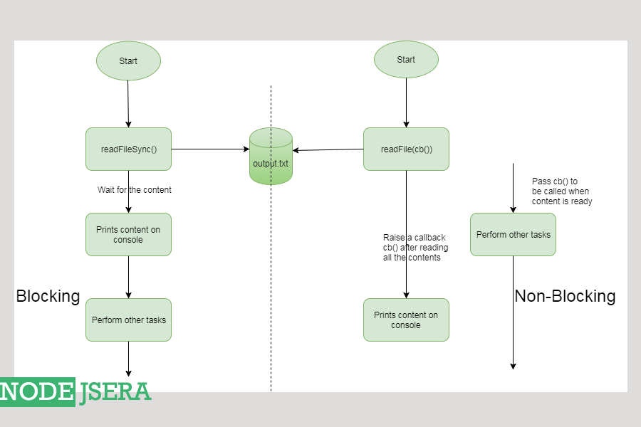

scenarios where the code can go blocking:

Calling some REST API and waiting for results.
Writing some data to a DB
Reading data from a file on FileSystem
Writing data to a file on FileSystem

There are 2 important things to observe from the output :
Another task to be executed is executed before the completion of the read file task which signifies towards the non-blocking nature of function and also the concept of callbacks.
Another interesting to observe is that the execution time comes only 3 which is incorrect . It is incorrect because as the program is running asynchronously here, so this 3 only signifies the time it took for the program to reach check point 2 from check point 1s and not the time the program took to read all the content.

Callback Hell
The level when so many callbacks are nested within other callbacks making it difficult to debug or understand the code. Callback hell is also known as Pyramid of Doom.
											
fxn1(function(){
    fxn2(function(){
        fxn3(function(){
            fxn4(function(){
				fxn5(function(){
					fxn6(function(){
						fxn7(function(){
							fxn8(function(){
								....
            
			
							});
						});
					});
				});
			});
        });
    });
});
											
										

Avoiding callback hell
Modularization : By making our code as much modular as possible, callback hell can be avaoided.
Promises : We can use the concepts of promises to avoid callback hell.
Async.js : Async is a very powerful module on npm , which can be used to avoid callback hell.
Chaining promises : We can avoid callback hell by chaining promises.